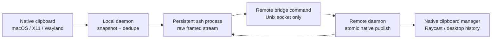

# Architecture

Each daemon owns a mode-`0600` Unix socket. `ssh-clipboard bridge` contains no clipboard or network logic; it copies stdin/stdout to that socket. The initiating daemon starts one persistent OpenSSH child per configured peer and speaks the same binary protocol in both directions.

## Clipboard pipeline

1. A platform backend enumerates every offered format and reads its raw bytes.
2. Sensitive clipboard markers exclude the entire value.
3. Common macOS types gain additive portable aliases. File-backed images are also rendered through AppKit while pasteboard access is available, so protected Messages attachments do not depend solely on filesystem traversal.
4. Readable file URL lists gain a private file bundle containing regular files/directories. If macOS denies direct access to an image attachment, its rendered image representation remains transferable.
5. A SHA-256 fingerprint detects unchanged clipboard snapshots.
6. The event receives a UUID and is sent over every peer’s newest-value channel.
7. The receiver deduplicates the UUID, relays it to other peers, materializes file bundles, and atomically publishes all safe representations. On macOS, portable MIME and X11 types are mapped to UTIs before publish (`text/plain` → `public.utf8-plain-text`, `image/png` → `public.png`, and so on); unrecognized non-UTI types are dropped so NSPasteboard is never asked to store `text/plain` or `UTF8_STRING`. A single image file is published as one pasteboard item containing both its native file URL and image data, making the same value pasteable in Finder and image-aware terminal or chat inputs. Multi-file selections remain native `NSURL` objects for Finder.
8. The hash of the clipboard actually published by the OS suppresses the watcher echo.

The protocol has an eight-byte prefix (`SCB1` plus a big-endian header length), a bounded JSON header, and raw representation bodies. Both header and aggregate body sizes are bounded before allocation.

## Service model

macOS runs a user LaunchAgent in the GUI session so `NSPasteboard` is available. Linux runs a user systemd service and imports the desktop display/session environment. No root service or privileged install is used.

## Multi-peer behavior

An SSH stream is intrinsically bidirectional, so the remote does not need to SSH back. The machine whose configuration lists several peers relays between those direct streams. UUID deduplication prevents cycles; newest-value channels bound memory during bursts.

## Decentralized updates

Every daemon is an update participant. It checks npm's stable `latest` release every 15 minutes and immediately rechecks when a capable peer announces a newer desired version. The desired version is persisted locally and included in every protocol hello, so it survives restarts and reconnects instead of depending on a transient event or a permanent coordinator. Network partitions may perform redundant checks, but version state only advances and therefore converges safely.

Setup is reconciliatory rather than destructive. It inspects each selected host over SSH, preserves an existing node ID and configuration, skips equal or newer binaries, upgrades older binaries atomically, and idempotently ensures the service definition exists. A healthy loaded service is left untouched; a stale loaded service is restarted once; and a missing macOS LaunchAgent is bootstrapped without immediately killing its new `RunAtLoad` process. When the macOS GUI launch domain or Linux user manager is unavailable, setup records the service for the next login rather than reporting a false installation failure.

The monitor polls daemon status every second independently from clipboard events. Losing the local daemon socket immediately invalidates live peer state, while known peers remain visible as reconnecting with their last reported machine name and version. Fresh status snapshots replace both local and peer versions after daemon or peer restarts, and the displayed target is the newest version known anywhere in the mesh. Protocol hellos include the detected system hostname separately from the configured alias, allowing the monitor to retain an accurate physical-machine label across reconnects even when an older setup left a stale alias behind. Its update action asks the daemon to check npm immediately and re-announce its desired version; capable peers independently verify and install that release. Established SSH sessions reset their reconnect delay, and offline retry delay is capped so a returning machine is discovered promptly.

Peer announcements never authorize code by themselves. Each recipient retrieves the release metadata and tarball from the npm registry, verifies npm's SHA-512 integrity value, verifies its platform binary against the package's SHA-256 manifest and executable header, and executes the staged binary's `--version` check. The previous executable remains at `ssh-clipboard.previous`; the verified replacement is renamed atomically and the daemon explicitly asks launchd or systemd to restart it, with the existing watchdog retaining rollback responsibility. This explicit restart and the idempotent LaunchAgent reconciliation shipped in v0.2.2 to resolve [issue #1](https://github.com/standardagents/ssh-clipboard/issues/1). Older peers remain protocol-compatible: their hellos omit application-version fields, and newer nodes do not send them update messages they cannot decode.

The local bridge command and peer hello can arrive in one Unix-socket read. The socket command reader remains in the protocol path so bytes buffered beyond `BRIDGE\n` are never discarded.
